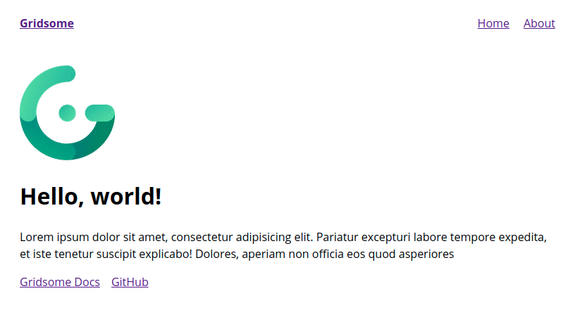
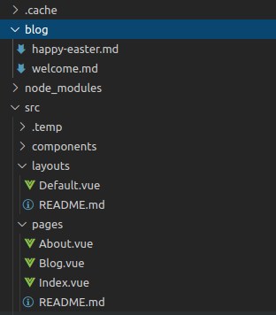
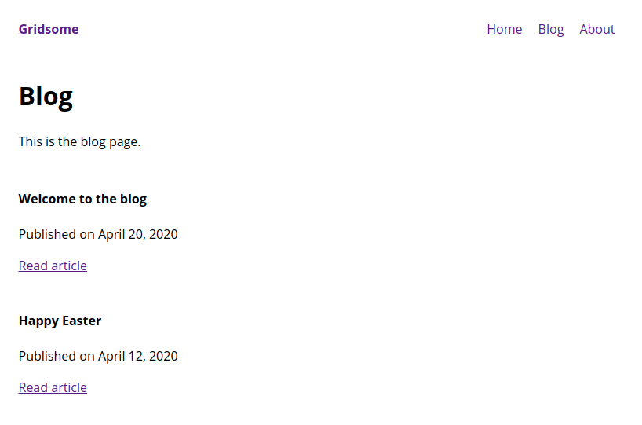

This is the first article of this blog, so what a better way to start then by writing about how this blog is built. This blog is using the JAMStack and is built using Gridsome. While the [Gridsome documentation](https://gridsome.org/docs/) is quite good, I find it lacks some more in-depth tutorials on how to link everything together.

In this short tutorial, we are going to build a very simple website with a homepage and a blog page which references all the blog posts. Lastly, we will use Markdown to generate a page for each blog post.

## Setup the project

For this tutorial, I'm going to assume that you already have NodeJS v12+ installed, and you have some knowledge about HTML, CSS, VueJS.

### Install Gridsome

Gridsome comes with a CLI tool to make it easier to spin up new project, so let's start by installing it.

```bash
npm install -g @gridsome/cli
```

### Create a Gridsome project

Now that we have the CLI tool installed we can go ahead and create our first project.

```bash
gridsome create gridsome-blog
```

This will create a new folder called `gridsome-blog`, it will also fetch all the required dependencies. Now let's move to that folder.

```bash
cd gridsome-blog
```

We are all setup and ready to start developing, so let's start the development server.

```bash
npm run develop
```

This will spin up a new server that serves your Gridsome project, you can access it in the browser using `http://localhost:8080/`.



## Add a blog page

By default, the Gridsome starter comes with a homepage and an about page. Let's add a new page to that for the blog. Fire up your code editor, and open the `gridsome-blog` folder.

In Gridsome pages are Vue components and stored in `src/pages/`, the routes are creating automatically for all the components inside that folder.
So create a `Blog.vue` component in `src/pages/`.

```js
// src/pages/Blog.vue

<template>
  <Layout>
    <h1>Blog</h1>
    <p>This is the blog page.</p>
  </Layout>
</template>

<script>
export default {
  metaInfo: {
    title: 'Blog'
  }
}
</script>
```

Great! We now have a blog page that is available at the URL `http://localhost:8081/blog/`. Let's add it to the navigation menu so it's discoverable.

Layout components in the folder `src/layouts` are used to wrap pages. Layouts should contain components like headers, footers or sidebars that will be used across the site. Again, these are just Vue components. Go ahead an add the link to `/blog/` in the default layout.

```js
// src/layouts/Default.vue

<template>
  <div class="layout">
    <header class="header">
      <strong>
        <g-link to="/">{{ $static.metadata.siteName }}</g-link>
      </strong>
      <nav class="nav">
        <g-link class="nav__link" to="/">Home</g-link>
        <g-link class="nav__link" to="/blog/">Blog</g-link>
        <g-link class="nav__link" to="/about/">About</g-link>
      </nav>
    </header>
    <slot/>
  </div>
</template>

// ...
```

## Create blog post pages

This page still feels very empty, so let's look at how we can add blog posts using Markdown. We will need 2 plugins for that:

- `@gridsome/source-filesystem`: Transform files into content that can be fetched with GraphQL in your components.
- `@gridsome/transformer-remark`: Markdown transformer for Gridsome with Remark.

These are quickly installable with NPM.

```bash
npm i -S @gridsome/source-filesystem @gridsome/transformer-remark
```

Once these plugins are installed, let's tell Gridsome look up the `blog` folder and add all posts so they can be queried later.

```js
// gridsome.config.js

module.exports = {
  siteName: 'Gridsome',
  plugins: [
    {
      use: '@gridsome/source-filesystem',
      options: {
        typeName: 'BlogPost',
        path: './blog/**/*.md',
      },
    },
  ],
  templates: {
    BlogPost: '/blog/:title',
  },
};
```

Few things are happening here, we are telling Gridsome to check the `blog` folder for Markdown files and add them as `BlogPost`. We are also defining a URL template for the type `BlogPost` using `/blog/:title`. Here the `title` of the blog post will be slugified to be URL safe.

Hum, that is great and all but we still don't have any content. So let's create some dummy blog posts. First, create the `blog` folder which will contain our blog posts.

`blog/welcome.md`

```md
---
title: 'Welcome to the blog'
date: 2020-04-20
---

## Welcome to the blog

This is the first post in this brand new blog.
Of course we have all the power of Markdown here,
so we can make things **bold** or _italic_.
```

`blog/happy-easter.md`

```md
---
title: 'Happy Easter'
date: 2020-04-12
---

## Happy Easter

As it turns out I'm writing this on Easter,
so why not include a picture of a easter egg here.


```

## Consume the data using GraphQL

Our file & folder structure should look like this now.



Let's restart the Gridsome development server so it picks up the new configuration and the files we have just created.

```
# stop running development server using Ctrl + C

npm run develop
```

Let's open the **GraphQL explorer** now to preview our blog posts. Open `http://localhost:8080/___explore` in your browser. Let's do our first GraphQL query to see a list of all blog posts.

```
# Write your query or mutation here
query {
  posts: allBlogPost {
    edges {
      node {
        id
        title
        date (format: "MMMM D, YYYY")
        path
      }
    }
  }
}
```

When we click the big **Play** button, we get the following result. We can see that our two blog posts that we created as Markdown files are now available through the GraphQL endpoint.

```json
{
  "data": {
    "posts": {
      "edges": [
        {
          "node": {
            "id": "46ea6f212d1378a5dcc360216e17dbc4",
            "title": "Welcome to the blog",
            "date": "April 20, 2020",
            "path": "/blog/welcome-to-the-blog/"
          }
        },
        {
          "node": {
            "id": "54c8892e9cf791f134c7ace95dcbcf5e",
            "title": "Happy Easter",
            "date": "April 12, 2020",
            "path": "/blog/happy-easter/"
          }
        }
      ]
    }
  }
}
```

## Query data and display in component

Remember our `blog` page, we created earlier? Now that we have some content, let's add it onto that page.

Before coming to the querying part, we are going to create a component that handles the display of the list of blog posts. Reusable Components live in `src/components/` and make your projects easier to maintain and test.

```js
// src/components/BlogPostList.vue

<template>
  <div class="post-list">
    <article class="post" v-for="post in posts" :key="post.node.id">
      <h4>{{post.node.title}}</h4>
      <p>Published on {{post.node.date}}</p>
      <g-link :to="post.node.path">Read article</g-link>
    </article>
  </div>
</template>

<script>
export default {
  props: ['posts']
}
</script>

<style>
.post-list {
  margin-top: 12px;
}

.post {
  padding: 12px 0;
}
</style>
```

We now have a reusable component to display a list of blog posts, we can include it in the Blog page now. We also add a `<page-query>` to get the list of blog posts from the GraphQL endpoint.

```js
// src/pages/Blog.vue

<template>
  <Layout>
    <h1>Blog</h1>
    <p>This is the blog page.</p>

    <BlogPostList :posts="$page.posts.edges"/>
  </Layout>
</template>

<script>
import BlogPostList from '~/components/BlogPostList.vue';

export default {
  metaInfo: {
    title: 'Blog'
  },
  components: {
    BlogPostList
  }
}
</script>

<page-query>
query {
  posts: allBlogPost {
    edges {
      node {
        id
        title
        date (format: "MMMM D, YYYY")
        path
      }
    }
  }
}
</page-query>
```

Awesome! Now when we go to `http://localhost:8081/blog/` we should see the list of blog posts.



## Creating the post page

If we were to click on any of the **Read article** article links, we end up on a 404 page. The 404 page can [easily be customized](https://gridsome.org/docs/pages/#custom-404-page) but that is not the topic here.

To create a page for each individual blog post, we need to use `templates`. Templates live in `src/templates/` and are used to create single pages for nodes in a collection (in this case the collection is `BlogPost`).

Let's create a new file `src/templates/BlogPost.vue` where we define how the Blog post should look. We'll need to add a page query again to get the post itself out of the GraphQL endpoint, this time we'll also need the field `content` as it contains the body in HTML of the post.

```js
// src/templates/BlogPost.vue

<template>
  <Layout>
    <article>
      <header>
      <h2>{{$page.post.title}}</h2>
      <p>Published on {{$page.post.date}}</p>

      <p><i>{{$page.post.timeToRead}}min to read</i></p>
      </header>

      <main class="content" v-html="$page.post.content"></main>
    </article>
  </Layout>
</template>

<style>
article > header {
  text-align: center;
}

.content {
  margin-top: 48px;
}
</style>

<page-query>
query Post ($path: String!) {
   post: blogPost (path: $path) {
    id
    title
    date (format: "MMMM D, YYYY")
    timeToRead
    content
  }
}
</page-query>
```

> And we're done! Congratulations!

While the blog itself is done, feel free to add additional content and feature to your website.
Check out the official [documentation for further information](https://gridsome.org/docs/).
